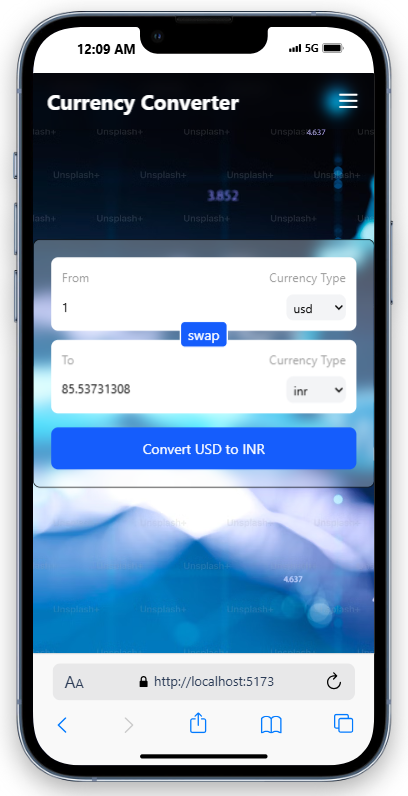
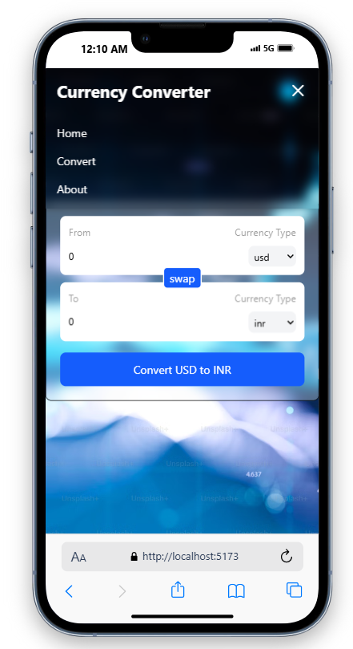
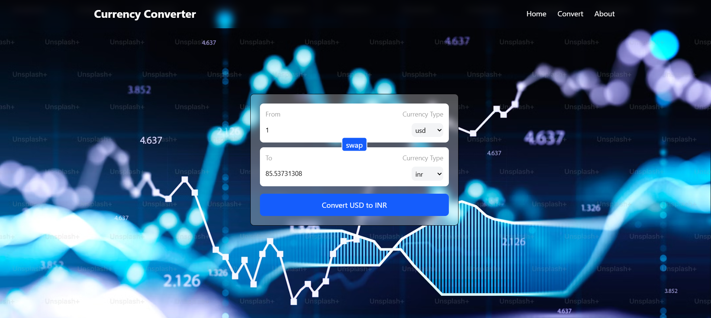

<h1 align="center"> Currency Converter Web App </h1>

A simple and efficient currency converter that allows users to convert between different currencies with real-time exchange rates.
#### Building this  Web app with intention of learning React better .

## #Features
```
✅ Convert between multiple currencies instantly
✅ Real-time exchange rates using an API
✅ User-friendly interface for easy conversion
✅ Lightweight and fast performance
✅ Supports multiple currencies worldwide
```

## #API url for latest currencies exchange rates.
<p align="center"> If you want to read API gitHub click
<a href = "https://github.com/fawazahmed0/exchange-api">  GitHub-Link </a> 
</p>

```javascript
let url = `https://cdn.jsdelivr.net/npm/@fawazahmed0/currency-api@latest/v1/currencies/inr.json`

```
# Screenshots

<table border="1" width="100%" cellspacing="0" cellpadding="10" >
  <tr>
    <th style="text-align:center;" colspan="2">Mobile View</th>
    
  </tr>
  <tr >
    <td align="center">
      
    </td>
    <td align="center">
      
    </td>
  </tr>
</table>

<p>--------------------------------------------------------------------------------------</p>
<table border="1" width="100%" cellspacing="0" cellpadding="10" >
  <tr>
    <th style="text-align:center;">Desktop View</th>
  </tr>
  <tr >
    <td align="center">
      
    </td>
  </tr>
</table>

## Technologies Used
```
1. Programming Language: JavaScript

2. API: Free Currency Exchange Rates API GitHub Link Provided above

3. Library: React
```

## Contributing
#### Contributions are welcome! Feel free to open an issue or submit a pull request.

## License
```
This project is licensed under the MIT License.

Copyright (c) 2025 Tanmay kumar

Permission is hereby granted, free of charge, to any person obtaining a copy  
of this software and associated documentation files (the "Software"),  
to deal in the Software without restriction, including without limitation  
the rights to use, copy, modify, merge, publish, distribute, sublicense,  
and/or sell copies of the Software.  

THE SOFTWARE IS PROVIDED "AS IS", WITHOUT WARRANTY OF ANY KIND.  
```
